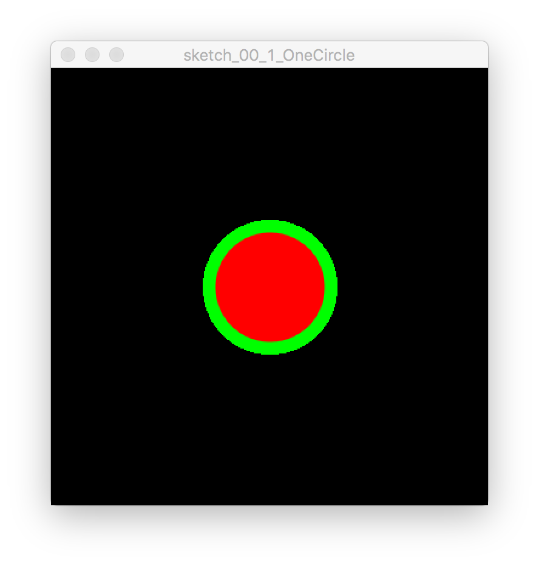
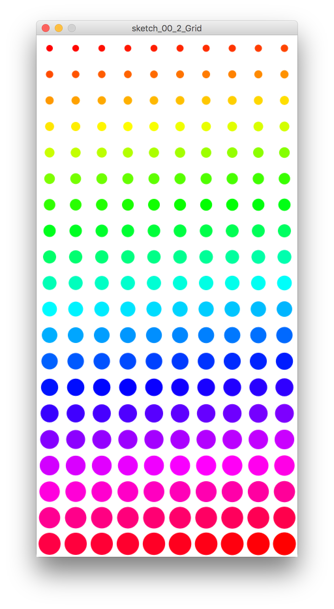
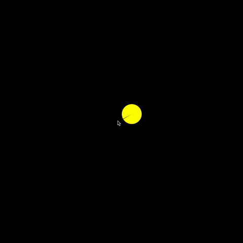
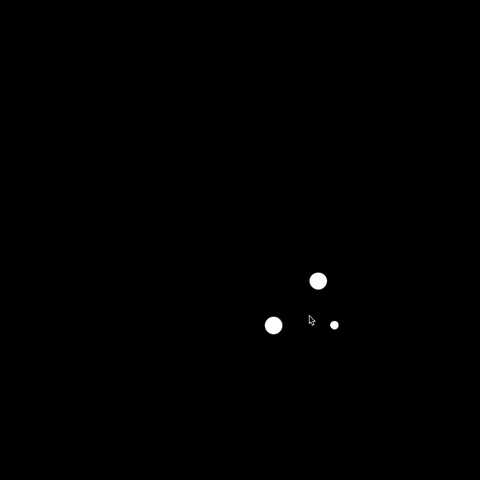
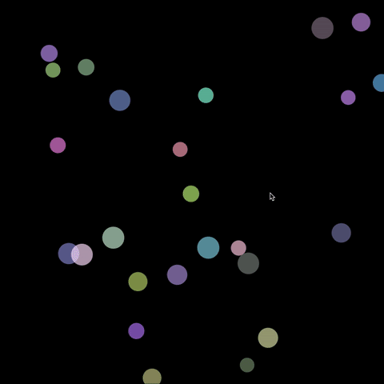
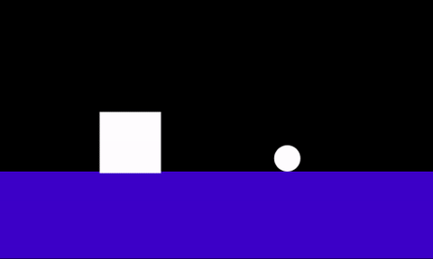

# Project 00 Documentation

## 1 - One Circle

[code](sketch_00_1_OneCircle/sketch_00_1_OneCircle.pde)

## 2 - Circle Grid

[code](sketch_00_2_Grid/sketch_00_2_Grid.pde)

## 3 - Pac Man

[code](sketch_00_3_PacMan/sketch_00_3_PacMan.pde)

[video](sketch_00_3_PacMan/3-PacMan-Documentation.mov)

## 4 - Personality Circles

[code](sketch_00_4_PersonalityCircles/sketch_00_4_PersonalityCircles.pde)

[video](sketch_00_4_PersonalityCircles/4-Personality-Documentation.mov)

## 5 - Boomshine

[code](sketch_00_5_Boomshine/sketch_00_5_Boomshine.pde)

[video](sketch_00_5_Boomshine/5-Boomshine-Documentation.mov)

## 6 - Scripted Shapes

[code](sketch_00_6_ScriptedShapes/sketch_00_6_ScriptedShapes.pde)

[video](sketch_00_6_ScriptedShapes/6-ScriptedShapes-Documentation2.mov)

